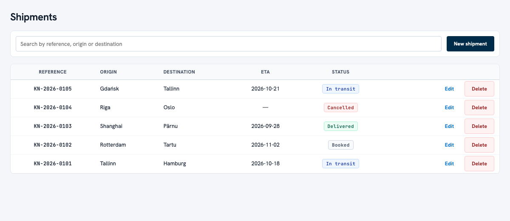
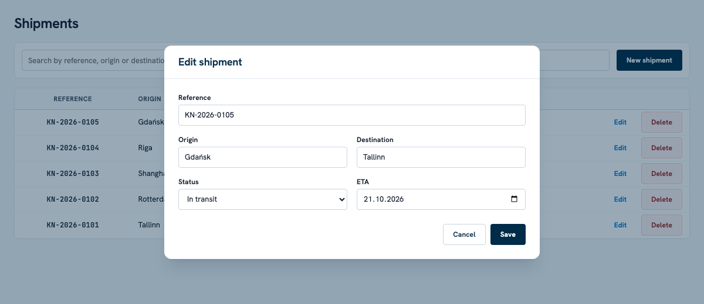

# Shipments

A small REST API for maintaining a list of shipments (Django REST framework) with a Vue 3 frontend. Built as the Kuehne+Nagel home assignment.





- **API:** list, retrieve, create, update (PUT and PATCH), delete, plus `?search=`. Five fields, server-side validation, JSON errors.
- **Frontend:** list with search, create and edit in a modal, delete with confirmation, loading, empty and error states.
- **Tests:** 23 backend tests written test-first, 100% coverage of the application code. The frontend is checked by hand, as the assignment allows.
- **CI:** GitHub Actions runs lint, tests with coverage, the frontend build and the design-token linter.

## Quick start

Needs **Python 3.10+** (the minimum Django 5.2 and DRF 3.18 declare; developed and tested on 3.12) and **Node 20.19+ or 22.12+** (the range Vite 8 declares; developed on 24). Two terminals.

**1. API** (http://localhost:8000/api/)

```bash
python3 -m venv .venv
source .venv/bin/activate        # Windows: .venv\Scripts\activate
pip install -r requirements.txt
python manage.py migrate
python manage.py runserver
```

**2. Frontend** (http://localhost:5173)

```bash
cd frontend
npm install
npm run dev
```

Open http://localhost:5173. The Vite dev server proxies `/api` to Django on port 8000, so there is nothing to configure. The database is a local SQLite file (`db.sqlite3`, not committed), so the list starts empty: use **New shipment**, or the curl examples below.

`npm run build` produces `frontend/dist`. Django does not serve it: this is a development setup, see [Notes for reviewers](#notes-for-reviewers).

## API

Base path `/api/`. Open any URL in a browser to use DRF's built-in browsable API, which doubles as interactive documentation.

| Method | URL | What it does | Success |
|---|---|---|---|
| GET | `/api/shipments/` | List, newest first. `?search=` filters | 200 |
| POST | `/api/shipments/` | Create | 201 |
| GET | `/api/shipments/{id}/` | Retrieve | 200 |
| PUT | `/api/shipments/{id}/` | Replace all fields | 200 |
| PATCH | `/api/shipments/{id}/` | Change only the fields sent | 200 |
| DELETE | `/api/shipments/{id}/` | Delete | 204 |

### Shipment

| Field | Type | Rules |
|---|---|---|
| `id` | integer | Read-only |
| `reference` | string, up to 32 | Required. Unique, ignoring case: `KN-0001` and `kn-0001` clash |
| `origin` | string, up to 100 | Required |
| `destination` | string, up to 100 | Required. Must differ from `origin`, ignoring case, also on PATCH |
| `status` | string | `booked` (default), `in_transit`, `delivered` or `cancelled` |
| `eta` | date `YYYY-MM-DD` or `null` | Optional |

**Search.** `?search=hamb` matches part of `reference`, `origin` or `destination`, ignoring case. Other fields are not searched.

**Errors.** Validation failures return 400 with the messages per field. An unknown id returns 404.

```json
{"destination": ["Destination must differ from origin."]}
```

### Examples

Real responses from a fresh database (shown compact, as `curl` prints them).

```bash
curl -s -X POST http://localhost:8000/api/shipments/ \
  -H 'Content-Type: application/json' \
  -d '{"reference": "KN-0001", "origin": "Tallinn", "destination": "Hamburg", "eta": "2026-11-01"}'
# 201 {"id":1,"reference":"KN-0001","origin":"Tallinn","destination":"Hamburg","status":"booked","eta":"2026-11-01"}

curl -s -X POST http://localhost:8000/api/shipments/ \
  -H 'Content-Type: application/json' \
  -d '{"reference": "kn-0001", "origin": "Riga", "destination": "Oslo"}'
# 400 {"reference":["A shipment with this reference already exists."]}

curl -s 'http://localhost:8000/api/shipments/?search=hamb'
# 200 [{"id":1,"reference":"KN-0001","origin":"Tallinn","destination":"Hamburg","status":"booked","eta":"2026-11-01"}]

curl -s -X PATCH http://localhost:8000/api/shipments/1/ \
  -H 'Content-Type: application/json' -d '{"status": "delivered"}'
# 200 {"id":1,"reference":"KN-0001","origin":"Tallinn","destination":"Hamburg","status":"delivered","eta":"2026-11-01"}

curl -s -X DELETE http://localhost:8000/api/shipments/1/
# 204 (no body)

curl -s http://localhost:8000/api/shipments/1/
# 404 {"detail":"No Shipment matches the given query."}
```

## Frontend

Vue 3 with `<script setup>`, built with Vite. Three small components:

- `App.vue`: the list, search and delete. Only the newest request may update the page, so a slow early response cannot overwrite a later search.
- `ShipmentForm.vue`: create and edit in a native `<dialog>`, which brings the backdrop, focus handling and Esc for free. Validation errors from the API appear under their field; errors that belong to no field, and failures to reach the API, appear in a banner.
- `api.js`: the `fetch` wrapper and the status list.

Styling is plain CSS (`style.css`) whose values come from [`DESIGN.md`](DESIGN.md). Fonts (Hanken Grotesk, JetBrains Mono) are self-hosted through `@fontsource`, so the page makes no third-party requests. On a narrow screen the table scrolls sideways inside its panel and the form switches to one column.

## Tests and checks

```bash
pip install -r requirements-dev.txt
python manage.py test                                   # 23 tests
coverage run --source=shipments --omit='*/migrations/*,*/tests.py' manage.py test
coverage report -m                                      # 43 statements, 100%
ruff check . && ruff format --check .
```

```bash
npx @google/design.md@0.4.0 lint DESIGN.md              # 0 errors, 0 warnings
cd frontend && npm run build
```

The tests use Django's own runner and DRF's `APITestCase`; there is no extra test framework. They cover every endpoint, the validation rules, 404s, search, and the PATCH and case-insensitivity edge cases. The frontend has no automated tests (the assignment does not ask for them); it was checked by hand against the running API: create, edit, delete, search and the empty result, field errors, an API that is down, Esc and Cancel, and a narrow screen.

**CI.** `.github/workflows/ci.yml` runs on every push and pull request: ruff, a check that migrations are in sync, the tests under coverage, `npm ci` with the build, and the DESIGN.md linter.

## Design

[`DESIGN.md`](DESIGN.md) holds the design tokens (colours, type, radii, spacing) and component presets in the open [DESIGN.md format](https://github.com/google-labs-code/design.md), and passes that format's linter. The CSS variables mirror its values; only what the app actually uses is in the file.

## Decisions

- **`ModelViewSet` and a router** give all six operations in a few lines; the browsable API replaces a Swagger dependency.
- **Validation lives in the serializer**, so API clients and the UI get the same rules and the same messages. `origin ≠ destination` falls back to the stored values on PATCH.
- **Four statuses**, the smallest set that covers a shipment's life: booked, in transit, delivered, cancelled. Adding one is a line in the model's choices, one in `api.js` and a badge style.
- **SQLite and two Python dependencies** (Django, DRF). Nothing else is needed for the brief.
- **Vite and single-file components** rather than a script tag, because that is how a real Vue codebase is laid out. No router, store or TypeScript: there is one screen.
- **The list is not paginated and the search is not debounced.** Both are deliberate shortcuts, marked in the code and listed below.

## Not done on purpose

Shortcuts with a known ceiling carry a `# ponytail:` comment in the code. This table is that ledger, plus what was left out of scope.

| Where | Shortcut | Ceiling | Revisit when |
|---|---|---|---|
| `shipments/views.py` | List is not paginated | Every call returns the whole table | The list outgrows a screen or two: enable DRF's `PageNumberPagination` |
| `shipments/views.py` | Search uses SQLite `LIKE` | Case-insensitive for ASCII only (`ülemiste` does not find `Ülemiste`) | Move to Postgres, or Elasticsearch at volume |
| `shipments/serializers.py` | Case-insensitive `reference` check in the serializer | Two simultaneous requests can both pass it | Add a unique constraint on `Lower("reference")` |
| `frontend/src/App.vue` | No debounce on search | One request per keystroke | The list or the latency grows |
| `frontend/src/ShipmentForm.vue` | Esc and Cancel are ignored while saving | A repeated Esc may still close the form | Send the request from `App` so it outlives the form |
| `frontend/src/api.js` | Statuses kept in step with the backend by hand | A status added only on the backend shows its raw value | Read the choices from `OPTIONS /api/shipments/` |

Left out of scope: authentication and permissions, optimistic locking (last write wins), Docker, Postgres, Elasticsearch, serving the frontend build from Django, TypeScript, end-to-end and frontend unit tests.

## How this was built

This project was built with AI assistance: **Claude Code** (Claude Sonnet 5.5, as recorded in the `Co-Authored-By` trailer of each commit) with the **ponytail** plugin, and the visual design started from **Google Stitch**.

**Why ponytail.** The brief is small and exact, and the usual way an AI assistant goes wrong on a task like that is by building more than was asked. ponytail pushes the other way: the smallest thing that works, the standard library and installed packages before new code, nothing speculative. That is where the short list of dependencies comes from, and why the code looks like this: a `ModelViewSet` instead of hand-written views, DRF's browsable API instead of Swagger, `SearchFilter` instead of Elasticsearch, Django's test runner instead of pytest, a native `<dialog>` instead of a modal library, no state library. A shortcut that has a ceiling is marked in the code and listed above rather than hidden.

**Why Stitch.** It was chosen as the starting point for the design. Fonts, colours and component presets came from it, and the style was refined as the page took shape; `DESIGN.md` records the result.

**How the work went.**

1. **A plan first**, then the work in small branches named `subproject/epic/task` (for example `api/shipments/crud`) and merged with `--no-ff`, so `git log --graph --oneline` shows the structure.
2. **Tests first.** For the API, each feature starts with a commit of failing tests, followed by the implementation. The red commits are in the history. The tests were also checked by deliberately breaking the code and watching the right test fail.
3. **Verified by running it.** Every endpoint was exercised with curl against a live server; the UI was driven in a browser, including the failure paths. CI steps were run in a fresh clone.
4. **Three review passes at the end:** a ponytail audit for over-engineering (unused Django defaults, the admin site, the ASGI entry point and repeated markup were removed), an AI code review (10 findings, 9 fixed, among them a form crash on a non-JSON error response and errors that were shown nowhere; one skipped: an automated check that CSS and `DESIGN.md` agree), and a security review (no high-confidence findings).

**Decisions that were the author's:** using ponytail for the code, Stitch for the design, tests before code, search and CI as extras, no automated frontend tests, and trimming the design file to what the app uses.

**Size.** Backend application code is 78 lines, the frontend source is 644 lines (349 of them CSS), and the tests are 188 lines.

## Project layout

```
config/               Django project: settings and the /api/ router
shipments/            models, serializer, viewset, tests, migration
frontend/             Vue 3 + Vite (src/App.vue, ShipmentForm.vue, api.js, style.css)
DESIGN.md             design tokens and component presets
docs/                 screenshots used in this README
.github/workflows/    CI
CLAUDE.md             working rules and commands for the assistant
requirements*.txt     pinned Python dependencies (runtime, and dev: coverage, ruff)
```

## Notes for reviewers

- **Development setup.** `DEBUG` is on, `SECRET_KEY` is the generated development placeholder, and there is no authentication, so every endpoint is open. That is fine for a local run and not for exposure to a network.
- The frontend build is not served by Django; run the two dev servers as in the quick start.
- `CLAUDE.md` is the assistant's briefing for this repository (rules and commands). It is kept because it is part of how the project was built.
